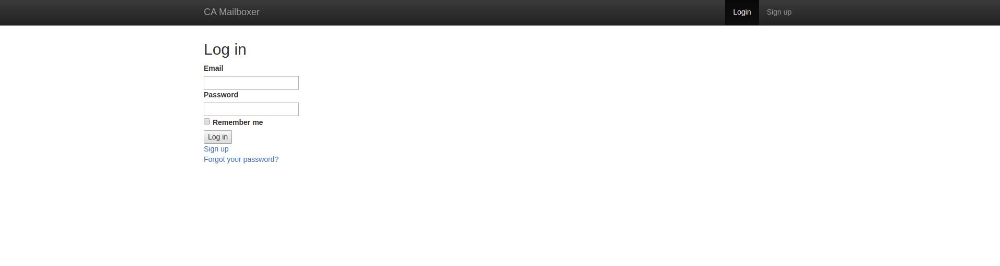

# Legacy Code Mailboxer 2020

### **Pair Programmer Team 4**
| Jaime Cruz | Philip Gaunitz | Anish Kanswal | Karolina Frostare |

### Code overview (Testing phase)
The client has an unmaintained message- app that they would like us to bring back to life. Team4 have therefore been tasked with testing the code base in order to find and fix bugs and poorly maintained functionality. 

We are currently testing the code base with the goal of deploying it to a staging server and a working state where adding new features is possible. For the time being the following bullet points **in bold** have been tested, making sure that the user: 

* **Can create an account**
* **Can log in to their account**
* **Can receive messages**
* **Can view messages in their inbox**
* Can log out of their account
* Gets notifications for new messages
* Can view sent messages
* Can respond to messages
* Can delete message
* Has a list of contacts
* Can send messages
* Can create messages
* Can restore deleted messages

### Installments
If you'd like to try and fix the app yourself you're free to help us out. You'll need to fork this Repo and download:

* Rails
> gem install rails
* Gems
> bundle install
* Rspec
> rspec-rails

### User stories
*The app has been built with 13 requests in mind. These are the user stories of our client.*

1. **Create an account**  
As a user  
In order to use the application  
I need to be able to create an account 

2. **Login to their account**  
As a user  
In order to access my inbox  
I would like to be able to login to my account 

3. **Can receive messages**  
As a user  
In order to keep in contact with my friends/family  
I would like to receive and keep their messages 

4. **Can view messages in their inbox** 
As a user  
In order to see my messages in Inbox  
I need to be able to access my Inbox 

5. **Can log out of their account** 
As a user  
In order to exit my account  
I would like a logout feature 

6. **Gets notifications for new messages** 
As a user  
In order to stay on top of my mails  
I would like to get notifications for new messages 

7. **Can respond to messages** 
As a user  
In order to communicate with my friends/family  
I want to be able to respond to their messages 

8. **Can delete message**
As a user  
In order to keep my inbox clean  
I want the ability to delete messages 

9. **Has a list of contacts**
As a user  
In order to save time  
I want access to a list of my contacts 

10. **Can send messages**
As a user  
In order to communicate with my friends/family  
I want the ability to send messages 

11. **Can create messages**
As a user  
In order to send/reply a message  
I need to be able to create a message 

12. **Can restore deleted messages**
As a user  
In order to restore wrongfully deleted messages  
I want the ability to move them from the trash back to the inbox 

### Dependencies
| Rspec | Pry-ByeBug | [Coveralls](https://coveralls.io/) | [Semaphore](https://coveralls.io/) | [Heroku](http://heroku.com/) |

### Setup
To access this code visit [GitHub](https://github.com/CraftAcademy/legacy_team4_2020)

### Instructions

### Acknowledgements
The material has been provided by [Craft Academy](learn.craftacademy.co)  
The app is being created in [Ruby on Rails](rubymonstas.org)  
The app is being tested in [Rspec](rspec.info)  

### Updates/Improvement Plans
The app is updated continuously and once it's finished it will look awesome.

### License
MIT License